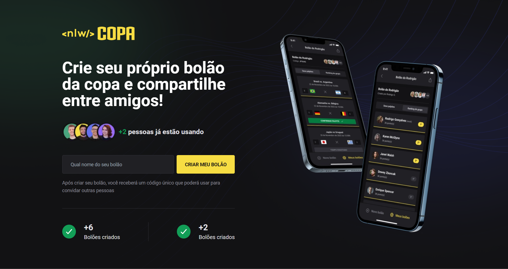
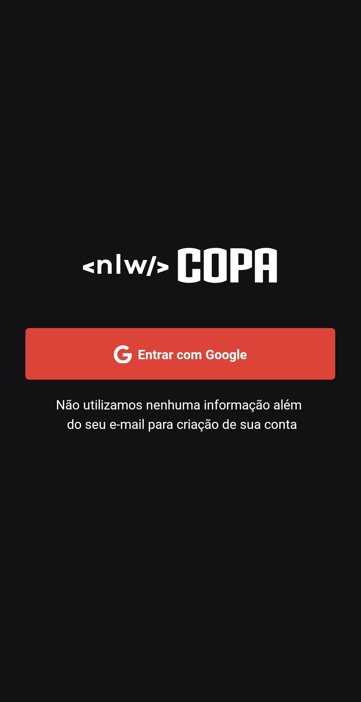
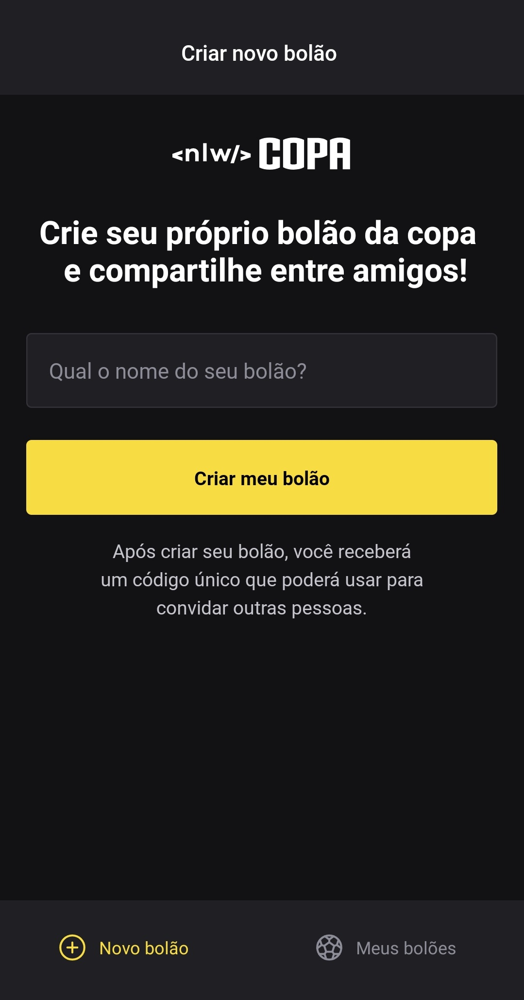
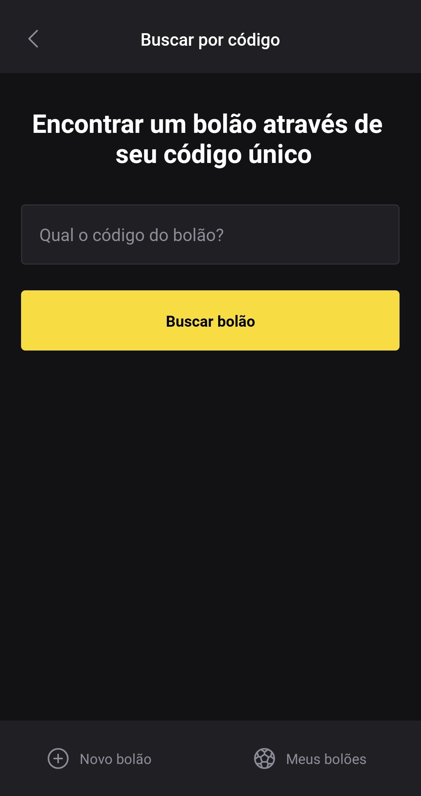

   

 

   
   
   
   

 

[**Sobre**](#-sobre) &nbsp;&nbsp;**|**&nbsp;&nbsp;
[**Features**](#-features) &nbsp;&nbsp;**|**&nbsp;&nbsp;
[**Tecnologias e Ferramentas**](#-tecnologias-e-ferramentas) &nbsp;&nbsp;**|**&nbsp;&nbsp;

## 📃 Sobre

O projeto destina-se a criar um ecossistema [**React**](https://pt-br.reactjs.org) desenvolvendo aplicações web, mobile e api com tema da copa, que permitirá os usuários a gerenciar bolões, dar palpites em jogos e compartilhá-los com seus amigos.

### Aplicação Web

### Aplicação Mobile

   
   
   

## ✨ Features

### Back-end

- [x] Criação de um bolão
- [x] Contagem de bolões, usuários e palpites cadastrados

### Front-end (Web)

- [x] Criação de um bolão
- [x] Exibição da quantidade de usuários, bolões, e palpites criados

### Mobile

- [x] Autenticação com o Google
- [x] Criação de um bolão
- [x] Fazer um palpite no jogo
- [x] Buscar um bolão

## 🚀 Tecnologias e Ferramentas

<table>
  <tbody>
    <tr>
      <td style="font-weight: bold">Back-end</td>
      <td>
        <a href="https://nodejs.org/en/" target="_blank" rel="noopener noreferrer">NodeJs</a>,
        <a href="https://www.typescriptlang.org/" target="_blank" rel="noopener noreferrer">Typescript</a>,
        <a href="https://www.prisma.io/" target="_blank" rel="noopener noreferrer">Prisma</a>,
        <a href="https://www.fastify.io/" target="_blank" rel="noopener noreferrer">Fastify</a>,
        <a href="https://zod.dev/" target="_blank" rel="noopener noreferrer">Zod</a>,
        <a href="https://www.sqlite.org/index.html" target="_blank" rel="noopener noreferrer">SQLite</a>
      </td>
    </tr>
    <tr>
      <td style="font-weight: bold">Front-end (web)</td>
      <td>
        <a href="https://reactjs.org/" target="_blank" rel="noopener noreferrer">React</a>,
        <a href="https://www.typescriptlang.org/" target="_blank" rel="noopener noreferrer">TypeScript</a>,
        <a href="https://nextjs.org/" target="_blank" rel="noopener noreferrer">NextJS</a>,
        <a href="https://tailwindcss.com/" target="_blank" rel="noopener noreferrer">TailwindCSS</a>,
        <a href="https://axios-http.com/docs/intro" target="_blank" rel="noopener noreferrer">Axios</a>
      </td>
    </tr>
    <tr>
      <td style="font-weight: bold">Mobile</td>
      <td>
        <a href="https://reactnative.dev/" target="_blank" rel="noopener noreferrer">React Native</a>,
        <a href="https://expo.dev/" target="_blank" rel="noopener noreferrer">Expo</a>,
        <a href="https://nativebase.io/" target="_blank" rel="noopener noreferrer">Native Base</a>
      </td>
    </tr>
  </tbody>
</table>