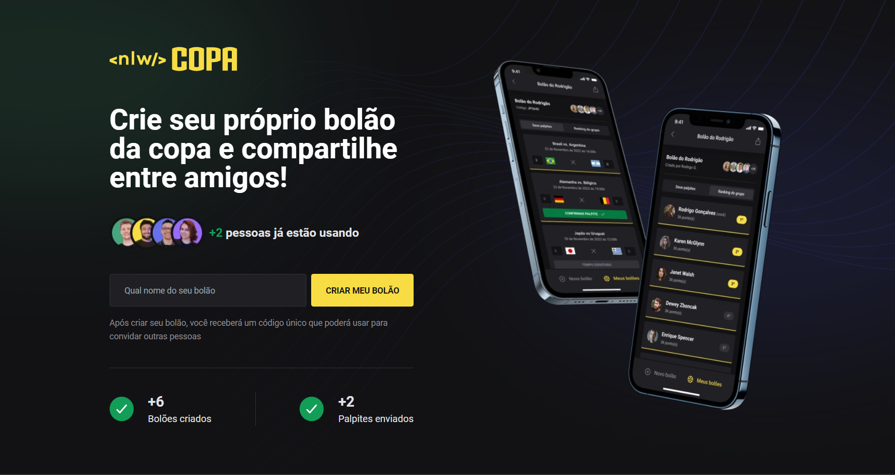

<div align="center">
   
</div>
<br/>
<div align="center">
   <a href="https://github.com/csdccarneiro">
      
   </a>
   
   
   <a href="https://github.com/mathrb22/nlw-copa-ignite/commits/main">
      
   </a>
</div>

</br>
<div align="center">

[**Sobre**](#-sobre) &nbsp;&nbsp;**|**&nbsp;&nbsp;
[**Features**](#-features) &nbsp;&nbsp;**|**&nbsp;&nbsp;
[**Instalação e Execução**](#-instalação-e-execução) &nbsp;&nbsp;**|**&nbsp;&nbsp;
[**Tecnologias e Ferramentas**](#-tecnologias-e-ferramentas) &nbsp;&nbsp;**|**&nbsp;&nbsp;

</div>

## 📃 Sobre

Esse é o front-end (Web) do **NLW Copa**, aqui você pode criar um bolão e visualizar a quantidade de bolões e palpites



## ✨ Features

### Front-end (Web)

- [x] Criação de um bolão
- [x] Exibição da quantidade de usuários, bolões, e palpites criados

## 👷 Instalação e Execução

```bash
# Clone o Repositório
https://github.com/csdccarneiro/nlw-copa.git
```

```bash
# Acesse a pasta do projeto
cd nlw-copa-frontend
```

```bash
# Instale as Dependências
npm install
```

```bash
# Crie as variaveis de ambiente, copiando o arquivo .env.example e renomeando para .env

# Certifique de adicionar valor para as variaveis de ambiente
cp .env.example .env
```

```bash
# Execute o Projeto.
npm run dev
```


## 🚀 Tecnologias e Ferramentas

<table>
  <tbody>
    <tr>
      <td style="font-weight: bold">Front-end (web)</td>
      <td>
        <a href="https://reactjs.org/" target="_blank" rel="noopener noreferrer">React</a>,
        <a href="https://www.typescriptlang.org/" target="_blank" rel="noopener noreferrer">TypeScript</a>,
        <a href="https://nextjs.org/" target="_blank" rel="noopener noreferrer">NextJS</a>,
        <a href="https://tailwindcss.com/" target="_blank" rel="noopener noreferrer">TailwindCSS</a>,
        <a href="https://axios-http.com/docs/intro" target="_blank" rel="noopener noreferrer">Axios</a>
      </td>
    </tr>
  </tbody>
</table>